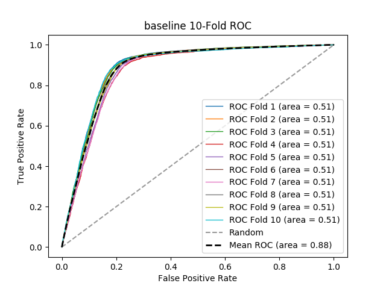

# baseline
**Model Performance Score Report**

### K-Fold Classification Report
| K | Accuracy | Precision | Recall | F-Measure | AUC | Kappa |
| --- | --- | --- | --- | --- | --- | --- |
| 1 | 0.7047846889952153 | 0.6951219512195121 | 0.013100436681222707 | 0.025716219264606356 | 0.5053341467383154 | 0.01487742064674602 |
| 2 | 0.6833219412166781 | 0.7684210526315789 | 0.015584970111016226 | 0.030550324335635072 | 0.5066865128053573 | 0.018051247044445273 |
| 3 | 0.6754613807245387 | 0.825 | 0.01375 | 0.027049180327868853 | 0.5061628942014242 | 0.016469195654882696 |
| 4 | 0.6725222146274777 | 0.8133333333333334 | 0.012608515915667631 | 0.024832078159983718 | 0.5055893886767882 | 0.014885984819151488 |
| 5 | 0.6767379861918108 | 0.7346938775510204 | 0.015078534031413612 | 0.029550584855325263 | 0.5062200058019865 | 0.016640451294538394 |
| 6 | 0.7046277941075945 | 0.6896551724137931 | 0.013780431786862656 | 0.02702094122945283 | 0.5055763472802927 | 0.01554099387923602 |
| 7 | 0.6614259347870668 | 0.8367346938775511 | 0.01633791591950588 | 0.03205002931405121 | 0.5073364917786916 | 0.019160376727753836 |
| 8 | 0.7057215120650763 | 0.7710843373493976 | 0.014712643678160919 | 0.028874351454996616 | 0.5064321074213355 | 0.017939236988774088 |
| 9 | 0.7153599015653839 | 0.7959183673469388 | 0.018474656560871626 | 0.036111111111111115 | 0.5082764365729312 | 0.023322389142124256 |
| 10 | 0.7310137398318408 | 0.8024691358024691 | 0.01631526104417671 | 0.031980319803198036 | 0.5074061039838075 | 0.0213588992333531 |

### Average Confusion Matrix
| | Pred POS | Pred NEG |
| --- | --- | --- |
| **True POS** | 67.8 | 4469.9 |
| **True NEG** | 19.9 | 10071.8 |

### Average Model Performance Metrics
| ACC | PRE | REC | F1 | AUC | KAPP |
| --- | --- | --- | --- | --- | --- |
| 0.6930977094112682 | 0.7732431921525594 | 0.014974336572889796 | 0.029373513985622907 | 0.506502043526093 | 0.017824619543100516 |

### AUC/ROC Plot

