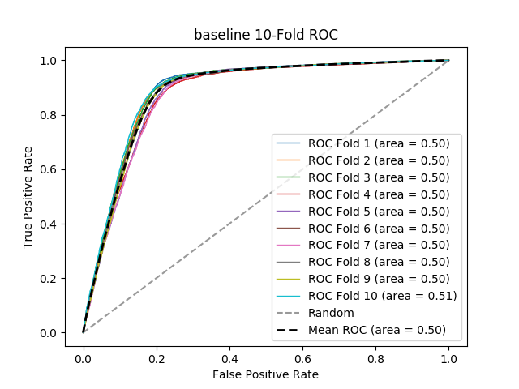

# baseline
**Model Performance Score Report**

### K-Fold Classification Report
| K | RMSE | Log Loss | Accuracy | Precision | Recall | F-Measure | AUC | Kappa |
| --- | --- | --- | --- | --- | --- | --- | --- | --- |
| 1 | 0.29589883800410116 | 10.219984621157197 | 0.7041011619958988 | 0.7115384615384616 | 0.00850379223167088 | 0.01680672268907563 | 0.5035222531544579 | 0.009851198308982512 |
| 2 | 0.3183868762816131 | 10.996693728165802 | 0.6816131237183869 | 0.7708333333333334 | 0.007899231426131512 | 0.015638207945900255 | 0.5033966295879904 | 0.009202684474454381 |
| 3 | 0.32597402597402597 | 11.258744758830698 | 0.674025974025974 | 0.7627118644067796 | 0.009375 | 0.018522329697468615 | 0.5039753942014242 | 0.010639418713096704 |
| 4 | 0.3291866028708134 | 11.36970323392029 | 0.6708133971291866 | 0.72 | 0.007441091360066143 | 0.014729950900163668 | 0.5030056763989874 | 0.008018850126514154 |
| 5 | 0.3237405154145875 | 11.181601654486226 | 0.6762594845854125 | 0.8679245283018868 | 0.009633507853403141 | 0.019055509527754765 | 0.5044615682153153 | 0.011974987486926936 |
| 6 | 0.29605577961583157 | 10.22540530176461 | 0.7039442203841685 | 0.7017543859649122 | 0.009186954524575103 | 0.01813647698934482 | 0.503766226654015 | 0.01052539799412977 |
| 7 | 0.34069314375555404 | 11.767124912694413 | 0.659306856244446 | 0.8070175438596491 | 0.009165172345088663 | 0.018124507486209616 | 0.5040102656730646 | 0.010500180512524326 |
| 8 | 0.29503041903069244 | 10.189990492473576 | 0.7049695809693075 | 0.765625 | 0.011264367816091954 | 0.0222020842772995 | 0.5049025409466684 | 0.01369731624504189 |
| 9 | 0.286759176977237 | 9.904311967339476 | 0.713240823022763 | 0.7288135593220338 | 0.010184746565608716 | 0.020088764307404812 | 0.5043236599168006 | 0.01223105904301347 |
| 10 | 0.27001162075329826 | 9.325871539809388 | 0.7299883792467018 | 0.8148148148148148 | 0.01104417670682731 | 0.021792966815255076 | 0.5050523842669881 | 0.014615555536229174 |

### Average Confusion Matrix
| | Pred POS | Pred NEG |
| --- | --- | --- |
| **True POS** | 42.3 | 4495.4 |
| **True NEG** | 13.0 | 10078.7 |

### Average Model Performance Metrics
| RMSE | LOGLOSS | ACC | PRE | REC | F1 | AUC | KAPP |
| --- | --- | --- | --- | --- | --- | --- | --- |
| 0.30817369986777543 | 10.643943221064166 | 0.6918263001322246 | 0.7651033491541871 | 0.009369804082946343 | 0.018509752063587674 | 0.5040416599015712 | 0.011125664844091332 |

### AUC/ROC Plot

