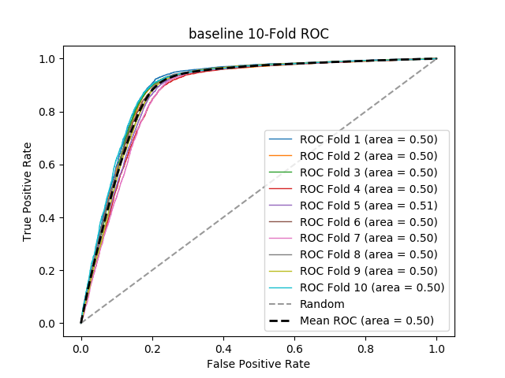

# baseline
**Model Performance Score Report**

### K-Fold Classification Report
| K | RMSE | Log Loss | Accuracy | Precision | Recall | F-Measure | AUC | Kappa |
| --- | --- | --- | --- | --- | --- | --- | --- | --- |
| 1 | 0.295352016404648 | 10.20109779893256 | 0.704647983595352 | 0.8 | 0.009193288899103653 | 0.01817768688934333 | 0.5041102158086335 | 0.011497770264448759 |
| 2 | 0.3183185235816815 | 10.99433285489223 | 0.6816814764183186 | 0.7872340425531915 | 0.007899231426131512 | 0.015641513422109492 | 0.5034469010539063 | 0.0093396023865564 |
| 3 | 0.32624743677375256 | 11.268188142615692 | 0.6737525632262474 | 0.7288135593220338 | 0.008958333333333334 | 0.01769911504424779 | 0.5036653314682944 | 0.009809592266221578 |
| 4 | 0.32939166097060835 | 11.376785635122433 | 0.6706083390293917 | 0.7111111111111111 | 0.006614303431169905 | 0.013106696702846612 | 0.5026433445260424 | 0.007054644410852795 |
| 5 | 0.3233303711805318 | 11.167436157105172 | 0.6766696288194681 | 0.8082191780821918 | 0.012356020942408378 | 0.024339933993399343 | 0.5054676390484317 | 0.014654084838680137 |
| 6 | 0.296329209105202 | 10.234849057782613 | 0.703670790894798 | 0.7021276595744681 | 0.00757923748277446 | 0.014996591683708248 | 0.5031083535345746 | 0.008694893293420214 |
| 7 | 0.34096657324492446 | 11.776568887345931 | 0.6590334267550755 | 0.7818181818181819 | 0.008567443713887228 | 0.01694915254237288 | 0.5036593722211475 | 0.009582621382078771 |
| 8 | 0.29619249436051676 | 10.2301272071028 | 0.7038075056394832 | 0.673469387755102 | 0.007586206896551724 | 0.015003409865878609 | 0.5030148176228064 | 0.008434883149163186 |
| 9 | 0.28710096383895 | 9.916116594039005 | 0.71289903616105 | 0.75 | 0.007816200852676456 | 0.015471167369901546 | 0.5033796099872108 | 0.009574765065410995 |
| 10 | 0.2704901223596965 | 9.342398454455761 | 0.7295098776403035 | 0.7755102040816326 | 0.009538152610441768 | 0.018844532606000497 | 0.5042524018101527 | 0.012308353804685646 |

### Average Confusion Matrix
| | Pred POS | Pred NEG |
| --- | --- | --- |
| **True POS** | 39.1 | 4498.6 |
| **True NEG** | 12.7 | 10079.0 |

### Average Model Performance Metrics
| RMSE | LOGLOSS | ACC | PRE | REC | F1 | AUC | KAPP |
| --- | --- | --- | --- | --- | --- | --- | --- |
| 0.30837193718205125 | 10.65079007893942 | 0.6916280628179489 | 0.7518303324297912 | 0.008610841958847842 | 0.017022980011980833 | 0.50367479870812 | 0.010095121086151848 |

### AUC/ROC Plot

