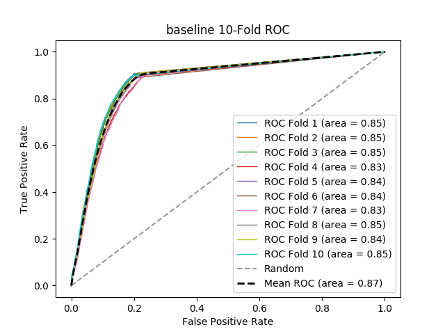

# baseline
**Model Performance Score Report**

### K-Fold Classification Report
| K | Accuracy | Precision | Recall | F-Measure | AUC | Kappa |
| --- | --- | --- | --- | --- | --- | --- |
| 1 | 0.8310321257689679 | 0.6562448029269915 | 0.9069179498965755 | 0.761482053261289 | 0.8529141748704593 | 0.6357976903851769 |
| 2 | 0.8295283663704717 | 0.6756496631376323 | 0.8992314261315115 | 0.771569884594248 | 0.8479668089837127 | 0.6399177153731461 |
| 3 | 0.8295283663704717 | 0.6802689180737961 | 0.9064583333333334 | 0.7772418720971775 | 0.8492108553747033 | 0.6436651552777319 |
| 4 | 0.8094326725905673 | 0.6541353383458647 | 0.899131872674659 | 0.7573119777158774 | 0.8321231258798131 | 0.6067600143611838 |
| 5 | 0.8121539408025156 | 0.6516534490498279 | 0.912041884816754 | 0.7601675685110839 | 0.8378963229644963 | 0.6126987101059505 |
| 6 | 0.8226809761432771 | 0.6473049882825578 | 0.8881488286632981 | 0.7488381099922541 | 0.8415440007063449 | 0.6169487997583851 |
| 7 | 0.8107184359833208 | 0.6631853785900783 | 0.9109384339509863 | 0.7675648451271719 | 0.8346575624489583 | 0.6144815184027952 |
| 8 | 0.8201517533666006 | 0.6387409200968523 | 0.9096551724137931 | 0.75049786628734 | 0.8459648563693636 | 0.6165157320477226 |
| 9 | 0.8165288126324424 | 0.625122030589001 | 0.9099952629085741 | 0.7411265432098765 | 0.8443029067497613 | 0.6064787023111862 |
| 10 | 0.8292432838881674 | 0.6311793785310734 | 0.8973393574297188 | 0.7410862354892205 | 0.8505484950605616 | 0.6193802426917907 |

### Average Confusion Matrix
| | Pred POS | Pred NEG |
| --- | --- | --- |
| **True POS** | 4102.7 | 435.0 |
| **True NEG** | 2182.2 | 7909.5 |

### Average Model Performance Metrics
| ACC | PRE | REC | F1 | AUC | KAPP |
| --- | --- | --- | --- | --- | --- |
| 0.8210998733916803 | 0.6523484867623675 | 0.9039858522219204 | 0.7576886956285539 | 0.8437129109408176 | 0.621264428071507 |

### AUC/ROC Plot

