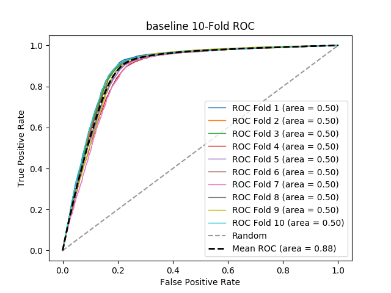

# baseline
**Model Performance Score Report**

### K-Fold Classification Report
| K | Accuracy | Precision | Recall | F-Measure | AUC | Kappa |
| --- | --- | --- | --- | --- | --- | --- |
| 1 | 0.7045112781954888 | 0.7692307692307693 | 0.009193288899103653 | 0.018169429934135815 | 0.5040129300804499 | 0.01122354592047392 |
| 2 | 0.6824333561175666 | 0.8518518518518519 | 0.00982066609735269 | 0.01941747572815534 | 0.5045081613213488 | 0.012208617369519836 |
| 3 | 0.6737525632262474 | 0.7547169811320755 | 0.008333333333333333 | 0.016484648670925202 | 0.503505425567989 | 0.009385649914407157 |
| 4 | 0.6706083390293917 | 0.7021276595744681 | 0.006821000413393965 | 0.013510747185261004 | 0.5026956309256512 | 0.007193184302690003 |
| 5 | 0.6753024813726161 | 0.711864406779661 | 0.008795811518324608 | 0.01737691352916839 | 0.5035353118886529 | 0.009484764872093376 |
| 6 | 0.7038758630118258 | 0.75 | 0.00757923748277446 | 0.01500682128240109 | 0.5032543389360346 | 0.009105781719982442 |
| 7 | 0.6594435709891312 | 0.7761194029850746 | 0.010360629607491532 | 0.020448289421942586 | 0.5043998777590007 | 0.011513138353454355 |
| 8 | 0.7036024335224554 | 0.6666666666666666 | 0.006436781609195402 | 0.012750455373406194 | 0.5025373907073121 | 0.0071037458960740985 |
| 9 | 0.7119420329482534 | 0.6176470588235294 | 0.004973945997157745 | 0.009868421052631578 | 0.501862393388701 | 0.00528160809816669 |
| 10 | 0.7298516645020166 | 0.8333333333333334 | 0.010040160642570281 | 0.01984126984126984 | 0.5046443170521446 | 0.013444259876306486 |

### Average Confusion Matrix
| | Pred POS | Pred NEG |
| --- | --- | --- |
| **True POS** | 37.5 | 4500.2 |
| **True NEG** | 12.5 | 10079.2 |

### Average Model Performance Metrics
| ACC | PRE | REC | F1 | AUC | KAPP |
| --- | --- | --- | --- | --- | --- |
| 0.6915323582914994 | 0.7433558130377429 | 0.008235485560069766 | 0.016287447201929706 | 0.5034955777627286 | 0.009594429632316836 |

### AUC/ROC Plot

