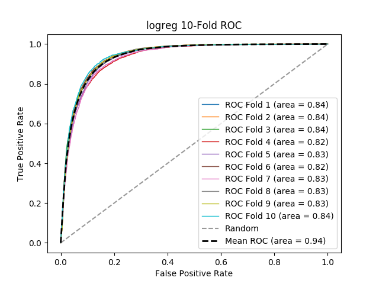

# logreg
**Model Performance Score Report**

### K-Fold Classification Report
| K | Accuracy | Precision | Recall | F-Measure | AUC | Kappa |
| --- | --- | --- | --- | --- | --- | --- |
| 1 | 0.8758031442241968 | 0.8204350025290845 | 0.7455757297173063 | 0.7812161348585189 | 0.8382514313534484 | 0.6947829345987429 |
| 2 | 0.8720437457279563 | 0.8410965550703542 | 0.7401793339026473 | 0.7874176697706109 | 0.8371618567763789 | 0.6964275556225152 |
| 3 | 0.8701298701298701 | 0.8429517502365185 | 0.7425 | 0.7895436420026584 | 0.8374758392675485 | 0.6961772347920294 |
| 4 | 0.8584415584415584 | 0.8328121241279769 | 0.7155849524596941 | 0.7697609783212896 | 0.8223043226350758 | 0.6684086993154859 |
| 5 | 0.8637637569211839 | 0.8175799086757991 | 0.7499476439790576 | 0.7823047515019116 | 0.8344319100755853 | 0.6834336930946255 |
| 6 | 0.8700526351767038 | 0.8328358208955224 | 0.7048690858980248 | 0.7635278019654187 | 0.8224588738492556 | 0.6747915543818312 |
| 7 | 0.8592521703465719 | 0.8191030616645105 | 0.7569236899780832 | 0.7867867867867868 | 0.8348093996196347 | 0.6819850063572674 |
| 8 | 0.8723084284640098 | 0.8152947154471545 | 0.7377011494252873 | 0.7745594979483467 | 0.8334872125178775 | 0.6857982575542618 |
| 9 | 0.8727869300704081 | 0.8212244897959183 | 0.7148270961629559 | 0.7643408889451689 | 0.825848255489953 | 0.6777910157434217 |
| 10 | 0.8821518900813453 | 0.8156424581005587 | 0.7329317269076305 | 0.7720782654680064 | 0.8354653937497288 | 0.6929147311385272 |

### Average Confusion Matrix
| | Pred POS | Pred NEG |
| --- | --- | --- |
| **True POS** | 3333.3 | 1204.4 |
| **True NEG** | 702.2 | 9389.5 |

### Average Model Performance Metrics
| ACC | PRE | REC | F1 | AUC | KAPP |
| --- | --- | --- | --- | --- | --- |
| 0.8696734129583804 | 0.8258975886543398 | 0.7341040408430687 | 0.7771536417568716 | 0.8321694495334487 | 0.6852510682598709 |

### AUC/ROC Plot

