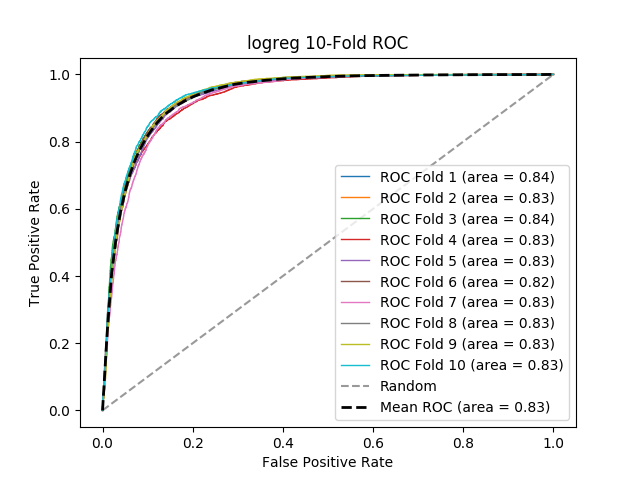

# logreg
**Model Performance Score Report**

### K-Fold Classification Report
| K | RMSE | Log Loss | Accuracy | Precision | Recall | F-Measure | AUC | Kappa |
| --- | --- | --- | --- | --- | --- | --- | --- | --- |
| 1 | 0.12412850307587149 | 4.28728525280526 | 0.8758714969241285 | 0.8209673335021525 | 0.7451160652723512 | 0.7812048192771085 | 0.8381675277232463 | 0.6948470634551033 |
| 2 | 0.1302118933697881 | 4.497394120100862 | 0.8697881066302119 | 0.8433407462317766 | 0.7286507258753202 | 0.7818119344863131 | 0.8324532535469503 | 0.6897188061477073 |
| 3 | 0.12747778537252222 | 4.402964326694491 | 0.8725222146274778 | 0.8404082579447923 | 0.7547916666666666 | 0.7953023817363626 | 0.8424009198033232 | 0.7031286500364005 |
| 4 | 0.13978127136021873 | 4.827912115338603 | 0.8602187286397812 | 0.8336917562724014 | 0.7211657709797437 | 0.7733569766153163 | 0.8250436698035974 | 0.673067910009602 |
| 5 | 0.13596281358944562 | 4.696032014099747 | 0.8640371864105544 | 0.8200827205882353 | 0.7474345549738219 | 0.7820751616084146 | 0.8339872186275645 | 0.6835804620282224 |
| 6 | 0.13145122701483355 | 4.540198862164154 | 0.8685487729851664 | 0.8296718199077842 | 0.702572347266881 | 0.7608506404676035 | 0.8207265629278444 | 0.671073513804257 |
| 7 | 0.1414997607491968 | 4.887274673463585 | 0.8585002392508032 | 0.8181229773462784 | 0.7555289898386133 | 0.7855811062771909 | 0.8339039330046344 | 0.6802395457695424 |
| 8 | 0.12769157153599014 | 4.410349225612063 | 0.8723084284640098 | 0.8186954288649204 | 0.7328735632183908 | 0.7734109655507035 | 0.8320949195603579 | 0.684896059987125 |
| 9 | 0.1271447125572493 | 4.3914587073652 | 0.8728552874427506 | 0.8212731229597389 | 0.7150639507342492 | 0.7644973410990125 | 0.8259666827755997 | 0.6779877248792061 |
| 10 | 0.11866839838676602 | 4.09869757018652 | 0.881331601613234 | 0.814317673378076 | 0.7309236947791165 | 0.7703703703703704 | 0.8342734960509015 | 0.6906768963243526 |

### Average Confusion Matrix
| | Pred POS | Pred NEG |
| --- | --- | --- |
| **True POS** | 3330.6 | 1207.1 |
| **True NEG** | 700.6 | 9391.1 |

### Average Model Performance Metrics
| RMSE | LOGLOSS | ACC | PRE | REC | F1 | AUC | KAPP |
| --- | --- | --- | --- | --- | --- | --- | --- |
| 0.1304017937011882 | 4.503956686783049 | 0.8695982062988119 | 0.8260571836996157 | 0.7334121329605156 | 0.7768461697488396 | 0.8319018183824021 | 0.6849216632441519 |

### AUC/ROC Plot

